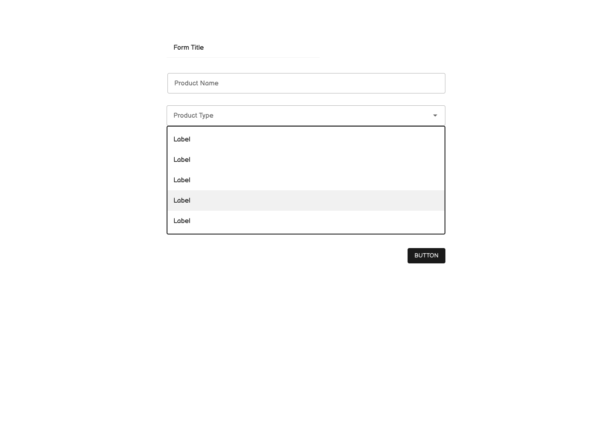
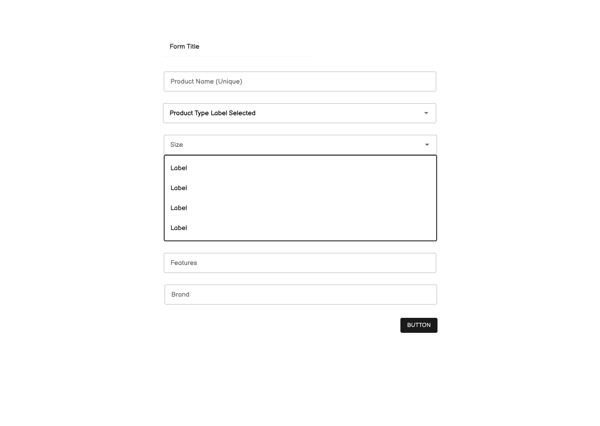

# react-take-home

React take home task for Sr. Frontend Dev role

Thank you for your application to SearchPilot! We greatly appreciate you taking the time to apply and your interest in working with us.

We have created a take home task and thank you taking the time to complete SearchPilot take-home challenge for our senior frontend developer role.

The task should hopefully not take too long. If you have any questions at all, please don’t hesitate to reach out to us.

The goal of this take home task is to build out a product list and product form. Please clone this repository: https://github.com/SearchPilot/react-take-home

### Task

- Display a list of products (Endpoint: `GET /api/products` and individual product endpoint: `GET /api/products/:id`)
- When user clicks on a product, user gets taken to a dynamic form and should see a form where they can edit product detail. Form should have these input fields:
  - Product name (User should be able to validate a unique product name `POST /api/validate`)
  - Product type
  - When product type is selected, user should then see options such as:
    - Size
    - Features
    - Brand
- Save the form (Endpoints: `PUT /api/products/:id`) - Please see the product detail page low fidelity mockup
- On the product list page, user can add a new product, which takes you to the product detail form page (Endpoint: `POST /api/products`)
- If anything appears ambiguous, please make your own choice on how to proceed. If there appears to be a roadblock of some sort, please do email us.

### Requirements

- Use React to build the frontend of the web application
- Implement all of the features shown in the design mockup and task list
- Ensure that the application is responsive and works on all devices
- Write clean, maintainable code that adheres to best practices

### Submission

Please submit your completed task as a GitHub repository or a CodeSandbox. Include instructions on how to run your application and any additional notes or comments that you think are relevant.

### Design Mockup

Product Detail Forms

Product Details Pages:

Feel free to design/style the list of products as you wish.
